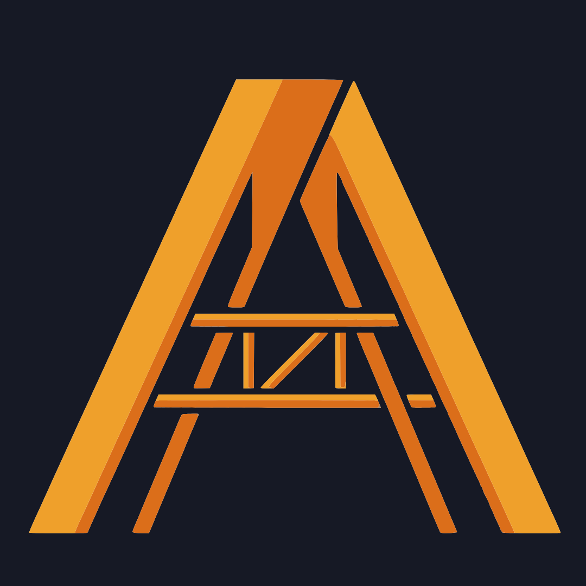

<p align="center">
  
</p>

# Armature

[](https://github.com/TuroYT/Armature/actions/workflows/ci.yml)
[](https://turoyt.github.io/Armature)
[](./LICENSE)
[](https://nodejs.org)

Opinionated NestJS boilerplate — Prisma, JWT auth, RBAC, typed errors, i18n, optional Redis/BullMQ, Stripe, and Google OAuth.

**Full documentation → [`/docs`](./docs/)** · [Getting Started](./docs/getting-started.md)

## Quick start

```bash
git clone git@github.com:TuroYT/Armature.git my-app
cd my-app
npm install
cp .env.example .env   # fill in DATABASE_URL, JWT_SECRET, JWT_REFRESH_SECRET
npx prisma migrate dev
npm run start:dev
```

Swagger UI → `http://localhost:3000/api/docs`

## Docs

```bash
pip install -r docs/requirements.txt
mkdocs serve
```

→ `http://localhost:8000`
