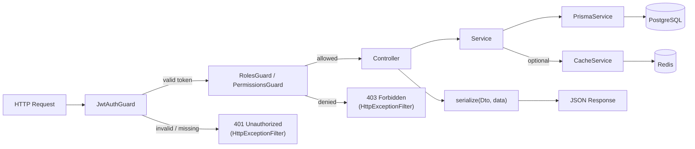

# Architecture

## Module structure

```
src/
├── app.module.ts               # Root module — wires everything together
├── main.ts                     # Bootstrap, Swagger setup, global pipes/filters
│
├── config/
│   ├── env.validation.ts       # Zod schema — crashes on bad env at startup
│   └── config.module.ts        # ConfigModule with Zod validation
│
├── prisma/
│   ├── prisma.service.ts       # @Global PrismaService — available everywhere
│   └── prisma.module.ts
│
├── common/
│   ├── logger/                 # Structured logging (port/adapter)
│   ├── constants/
│   │   ├── error-constants.ts  # ErrorCode as const — never use raw strings
│   │   └── translations/       # fr.ts, en.ts — Record<ErrorCode, string>
│   ├── filters/
│   │   └── http-exception.filter.ts  # Translates ErrorCode via Accept-Language
│   ├── services/
│   │   └── i18n.service.ts
│   ├── dto/
│   │   ├── params.dto.ts       # Shared param DTOs (IdParamsDto…)
│   │   ├── pagination-query.dto.ts
│   │   ├── paginated-response.dto.ts
│   │   └── error-response.dto.ts
│   └── utils/
│       └── serialize.ts        # plainToInstance wrapper — @Expose() only
│
├── cache/
│   └── cache.service.ts        # Optional Redis — no-op when REDIS_URL absent
│
├── guards/
│   ├── permissions.guard.ts    # @RequirePermissions() — Redis-cached resolution
│   ├── roles.guard.ts          # @Roles() — coarse role check
│   └── ownership.guard.ts      # Generic resource ownership check
│
├── auth/
│   ├── auth.module.ts
│   ├── auth.service.ts         # register, login, refresh, logout, getMe
│   ├── auth.controller.ts      # POST /api/auth/*, GET /api/auth/methods
│   ├── auth.guard.ts           # JWT guard — attaches user to request
│   ├── decorators/
│   │   ├── public.decorator.ts       # @Public() — skip auth guard
│   │   └── current-user.decorator.ts # @CurrentUser() param decorator
│   ├── strategies/
│   │   ├── jwt.strategy.ts
│   │   └── jwt-refresh.strategy.ts
│   ├── dto/
│   └── social/
│       ├── social-provider.port.ts   # Abstract SocialProvider + SOCIAL_PROVIDER token
│       ├── social-auth.service.ts    # Shared handleCallback() for all OAuth providers
│       ├── google-auth.module.ts     # Self-activating dynamic module
│       ├── google-auth.controller.ts
│       ├── google.strategy.ts
│       └── google-social.provider.ts
│
├── health/
│   └── health.controller.ts    # GET /api/health
│
├── queue/
│   └── queue.module.ts         # Self-activating — requires REDIS_URL
│
├── payment/
│   └── payment.module.ts       # Self-activating — requires STRIPE_* keys
│
└── resource/                   # Example CRUD module — clone this for new features
    ├── resource.module.ts
    ├── resource.controller.ts
    ├── resource.service.ts
    └── dto/
```

## Request lifecycle



## Key design patterns

### Global modules

`PrismaModule` and `LoggerModule` are `@Global()`. Their services (`PrismaService`, `LoggerService`) are available in every module without being imported explicitly.

### Self-activating dynamic modules

Optional features use `static register()` which reads `process.env` at startup:

```ts
static register(): DynamicModule {
  const isActive = !!process.env['FEATURE_KEY'];

  if (!isActive) {
    new Logger('FeatureModule').warn('Feature disabled — env var missing');
    return { module: FeatureModule }; // empty module, no controllers registered
  }

  return {
    module: FeatureModule,
    controllers: [FeatureController], // only registered when active
    providers: [...],
  };
}
```

This keeps the Swagger documentation accurate — routes only appear when the module is active.

### Port / Adapter

Used for the logger and for social auth providers. The port defines a stable interface; adapters implement it independently. Switching a transport (e.g. adding a file logger) requires no changes to consumers.

### Serialization

All service responses pass through `serialize(DtoClass, plain)` before leaving a controller. Only fields decorated with `@Expose()` on the DTO class are included — `passwordHash` and other sensitive fields are stripped automatically.

```ts
import { serialize } from '../common/utils/serialize.js';

return serialize(UserResponseDto, {
  ...user,
  roles: user.userRoles.map((ur) => ur.role),
});
```

### Error handling

1. Services throw `new XxxException(ErrorCode.SOME_CODE)`
2. The global `HttpExceptionFilter` intercepts every HTTP exception
3. It reads the `Accept-Language` header and calls `I18nService.translate(code, lang)`
4. The translated message is returned in the JSON error body

Clients never receive raw error codes; they receive a translated human-readable message.

## Prisma client location

The Prisma client is generated to `generated/prisma/` (not the default `node_modules`). Always import from the generated path:

```ts
import { PrismaClient } from '../../generated/prisma/client.js';
```

The `prisma.config.ts` file at the root configures the datasource URL separately from `schema.prisma` (Prisma 7 requirement):

```ts
// prisma.config.ts
export default defineConfig({
  datasource: { url: process.env['DATABASE_URL']! },
});
```
