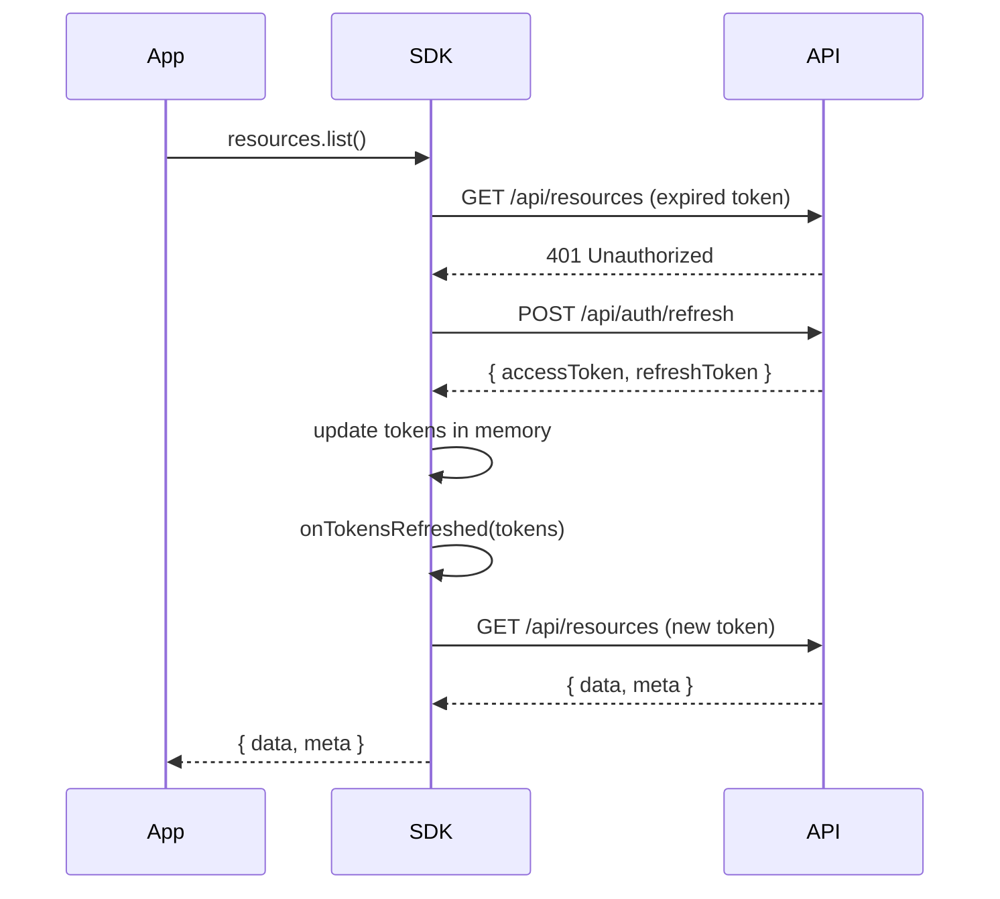
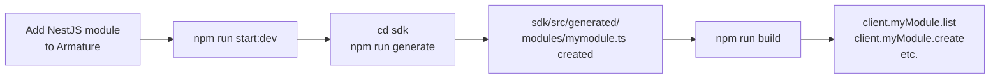

# SDK Client

The Armature SDK is a typed TypeScript client that wraps the REST API and WebSocket layer. It handles token management automatically, supports OAuth providers, and stays up to date with your backend via OpenAPI code generation.

## Installation

=== "Monorepo (local)"
    ```bash
    # From your app, reference the sdk/ package directly
    npm install ../sdk
    ```

=== "npm (after publish)"
    ```bash
    npm install armature-sdk
    ```

## Quick start

=== "React / Vite"
    ```typescript
    import { ArmatureClient } from 'armature-sdk';

    const client = new ArmatureClient({
      baseUrl: import.meta.env.VITE_API_URL,
      onTokensRefreshed: (tokens) => {
        localStorage.setItem('armature_tokens', JSON.stringify(tokens));
      },
    });

    // Restore tokens on startup
    const saved = localStorage.getItem('armature_tokens');
    if (saved) client.setTokens(JSON.parse(saved));

    // Login
    const { user } = await client.auth.login({ email, password });

    // CRUD
    const { data, meta } = await client.resources.list({ page: 1, limit: 20 });
    const resource = await client.resources.create({ name: 'Hello' });
    ```

=== "Next.js"
    ```typescript
    // lib/sdk.ts
    import { ArmatureClient } from 'armature-sdk';

    export const sdk = new ArmatureClient({
      baseUrl: process.env.NEXT_PUBLIC_API_URL!,
      onTokensRefreshed: (tokens) => {
        // Store in cookies, zustand, or your state manager
      },
    });
    ```

=== "Node.js"
    ```typescript
    import { ArmatureClient } from 'armature-sdk';

    const client = new ArmatureClient({ baseUrl: 'http://localhost:3000' });
    await client.auth.login({ email: 'admin@example.com', password: 'password' });

    const resources = await client.resources.list();
    console.log(resources.data);
    ```

---

## Token management

The SDK stores tokens **in memory** and rotates them automatically. When a request returns `401`, the SDK:



!!! tip "Persisting tokens"
    Pass `onTokensRefreshed` to keep tokens in sync with your storage layer (localStorage, cookies, Zustand, etc.):

    ```typescript
    const client = new ArmatureClient({
      baseUrl: '...',
      onTokensRefreshed: (tokens) => {
        localStorage.setItem('tokens', JSON.stringify(tokens));
      },
    });
    ```

!!! warning "Token expiry on page reload"
    Tokens are in-memory only. Call `client.setTokens(...)` on startup to restore a previous session.

---

## Auth

```typescript
// Email / password
const { user, accessToken, refreshToken } = await client.auth.login({ email, password });
const { user } = await client.auth.register({ email, password, firstName?, lastName? });

// Current user
const me = await client.auth.me();

// Logout (invalidates refresh token server-side)
await client.auth.logout();

// Refresh tokens manually
const tokens = await client.auth.refresh();

// Available auth methods on this server
const methods = await client.auth.methods();
```

### OAuth providers

=== "Redirect"
    ```typescript
    // Redirects the browser to the provider consent screen
    client.auth.socialRedirect('google');
    ```

=== "Callback"
    ```typescript
    // On the callback page, extract the token from the URL
    // e.g. https://yourapp.com/auth/callback?accessToken=xxx&userId=yyy
    const token = client.auth.handleOAuthCallback();
    // token is stored in the client automatically
    ```

---

## Resources

```typescript
// List (paginated + search)
const { data, meta } = await client.resources.list({ page: 1, limit: 20, q: 'search' });

// Get by ID
const resource = await client.resources.get('resource-id');

// Create (requires resources:write permission)
const created = await client.resources.create({ name: 'My resource', description: 'optional' });

// Update (owner or admin)
const updated = await client.resources.update('resource-id', { name: 'New name' });

// Delete (admin only)
await client.resources.delete('resource-id');
```

---

## Real-time (WebSocket)

```typescript
// Open a WebSocket connection (uses the current access token)
const ws = client.realtime();

// Listen to server events
ws.on('resource:created', (resource) => console.log('created', resource));
ws.on('resource:updated', (resource) => console.log('updated', resource));
ws.on('resource:deleted', ({ id }) => console.log('deleted', id));

// Join a room for scoped broadcasts
ws.subscribe('admin');

// Liveness check
ws.ping();
ws.on('pong', ({ userId, timestamp }) => console.log('pong from', userId));

// Leave room / disconnect
ws.unsubscribe('admin');
ws.disconnect();
```

!!! note "Authentication"
    `client.realtime()` reads the current `accessToken` from memory. Call it **after** a successful login or `setTokens()`.

!!! warning "connect_error vs error"
    Auth failures surface as `connect_error`, **not** `error`. Always listen to both events when debugging connection issues.

---

## Health check

```typescript
const health = await client.health.check();
// { status: 'ok', info: { database: { status: 'up' } } }
```

---

## Adding a new module (codegen)

When you add a new NestJS module to Armature and want the SDK to expose it automatically:



```bash
# 1. Start the backend (spec must be live)
npm run start:dev

# 2. From sdk/
npm run generate
# → reads GET http://localhost:3000/api/docs-json
# → generates src/generated/modules/<tag>.ts for every new tag
# → updates src/generated/index.ts

# 3. Rebuild
npm run build
```

!!! tip "Generated files"
    Never edit files inside `sdk/src/generated/` — they are overwritten on every `npm run generate`.
    Put hand-written customisations in `sdk/src/modules/` instead.

---

## Error handling

All API errors are thrown as `ArmatureError`:

```typescript
import { ArmatureError } from 'armature-sdk';

try {
  await client.resources.get('unknown-id');
} catch (err) {
  if (err instanceof ArmatureError) {
    console.log(err.status); // 404
    console.log(err.code);   // "RESOURCE_NOT_FOUND"
    console.log(err.message); // translated message
  }
}
```

| `code` | `status` | Meaning |
|--------|----------|---------|
| `UNAUTHORIZED` | 401 | Missing or expired token (after refresh failed) |
| `FORBIDDEN` | 403 | Insufficient permissions |
| `RESOURCE_NOT_FOUND` | 404 | Entity does not exist |
| `CONFLICT` | 409 | Duplicate (e.g. email already in use) |
| `UNKNOWN_ERROR` | — | Unexpected server error |
